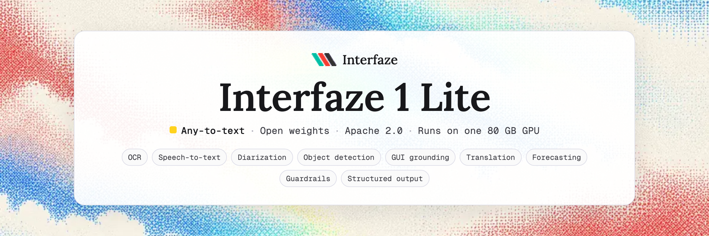

# Interfaze 1 Lite

[Website](https://interfaze.ai) · [Docs](https://interfaze.ai/docs) · [Run tasks](https://interfaze.ai/docs/run-tasks) · [Blog](https://interfaze.ai/blog/the-first-open-weight-model-for-deterministic-work-interfaze-1-lite) · [Hugging Face](https://huggingface.co/interfaze-ai/interfaze-1-lite)

## Introduction

Interfaze 1 Lite is a mixture-of-architectures (MoA) model for developer workloads: reading documents, transcribing speech, locating objects and interface elements, and answering over all of it with structured output.

A single vision-language reasoning core works alongside a set of specialist architectures, each built for one kind of perception. The core reads the request, decides which specialists to run, and composes the answer from what they return. The whole model runs on one 80 GB GPU with no external services.

### Key features

- **Document understanding.** Text, reading order, tables and layout from images, PDFs (up to 50 pages a call) and Word files, with a box and confidence for every line and word.
- **Speech.** Transcription with timestamps and speaker diarization. Long recordings are cut at pauses and decoded in batches: a 95-minute recording transcribes in about 90 seconds.
- **Visual grounding.** Open-vocabulary object detection with outlines, and GUI element grounding for computer-use agents.
- **Structured output.** Responses constrained to a JSON schema you supply, reading from any mix of text, images, documents and audio.
- **Translation, forecasting and guardrails.** Translation across 160+ languages, time-series forecasting from CSV or JSON, and safety checks on text and images.
- **Multilingual reasoning.** Science, math, SQL and general knowledge across 14+ languages, with a 131k-token context.
- **Self-contained.** One repository, one GPU, runs offline.

### Model architecture

Interfaze 1 Lite is not one network. It is a reasoning core plus specialists, each chosen for the task it is best at, connected by tool calls.

| Component | Architecture | Role |
|---|---|---|
| Reasoning core | Hybrid-attention decoder with a vision encoder, FP8, 131k context | Plans, calls specialists, grounds boxes on a 0–1000 grid, writes the answer |
| Document reader | Vision-language model trained for page reading | Text, reading order, tables and markdown |
| Line geometry | Text detector and recognizer | Every line's box and confidence |
| Layout | Document layout detector | Titles, paragraphs, tables and figures, with boxes |
| Speech | Encoder-decoder speech recognizer | Transcripts and timestamps in 99 languages |
| Diarization | Speaker segmentation and embedding pipeline | Who spoke when |
| Segmentation | Promptable segmentation model | Object outlines and masks |
| Forecasting | Time-series foundation model | Future values of a numeric series |
| Guardrails | Safety classifier | 14 text safety categories |

How the parts combine:

- **OCR is two views of one page, stitched.** The document reader supplies the text, and the line detector supplies the geometry. Each detected line takes the reader's words for it, so boxes are exact and text is complete.
- **Speakers are attributed per word,** by the largest overlap with each speaker's turns, then grouped into chunks.
- **Detection and GUI grounding run on the reasoning core,** which returns boxes on a 0–1000 grid. Outlines come from the segmentation model.
- **A run task skips planning.** Naming one capability (`task="ocr"`, `"speech_to_text"`, …) runs that specialist directly and returns its raw result.

## Performance

| Benchmark | What it measures | **Interfaze 1 Lite** | Interfaze | GPT-5.4-Mini | Claude-Sonnet-4.6 | Gemini-3-Flash | Grok-4.3 |
|---|---|---|---|---|---|---|---|
| GPQA Diamond | Graduate-level science | **85.9** | 92.4 | 82.8 | 89.9 | 88.5 | 73.6 |
| MMMLU | Knowledge in 14 languages | **87.8** | 90.9 | 75.3 | 84.9 | 88.7 | 89.7 |
| MMMU-Pro | Multimodal reasoning | **73.2** | 71.1 | 40.4 | 46.3 | 67.6 | 68.7 |
| olmOCR-Bench | Document OCR | **83.8** | 85.7 | 80.1 | 73.9 | 75.3 | 81.9 |
| OCRBench v2 (English) | Text in images | **60.9** | 70.7 | 52.7 | 54.7 | 55.8 | 54.7 |
| RefCOCO (Acc@0.5) | Referring-expression grounding | **83.8** | 82.1 | – | – | – | – |
| VoxPopuli-Cleaned (WER ↓) | Speech recognition | **3.01** | 2.4 | – | – | 4.0 | – |
| SOB (value accuracy) | Structured output from text, images and audio | **81.5** | 80.5 | – | 77.9 | 77.3* | – |
| Spider 2.0-Lite (SQLite) | Text-to-SQL | **48.9** | 52.9 | 26.7 | 49.6 | 45.2 | 45.9 |

Interfaze 1 Lite was scored by us with each benchmark's official scorer ([evaluation code](https://github.com/InterfazeAI/interfaze-complete-benchmarks/tree/main/interfaze-lite-evals)). Every other score is from the [Interfaze leaderboard](https://interfaze.ai/leaderboards). Higher is better except WER. \*Gemini-3-Flash-Preview.

### The benchmarks

- **GPQA Diamond** (all 198 questions). Graduate-level physics, chemistry and biology multiple choice, written to resist search. Lite scores 85.9, ahead of GPT-5.4-Mini and Grok-4.3, and strongest in physics.
- **MMMLU** (MMMLU-lite, all 19,950: 1,425 questions in each of 14 languages). MMLU translated by professional translators. Lite averages 87.8, ahead of Claude-Sonnet-4.6. The low-resource languages (Swahili, Yoruba, Bengali) are where it loses most.
- **MMMU-Pro** (all 1,730 questions per track, mean of standard and vision tracks). College-level questions that need the image, including a track where the question itself is inside the picture. Lite leads the board at 73.2.
- **olmOCR-Bench** (all 1,403 PDFs). Unit tests on real documents: arXiv math, old scans, tables, headers and footers, multi-column pages and long tiny text. Lite scores 83.8, with 91.9 on long tiny text and 88.8 on tables.
- **OCRBench v2, English** (all 7,400 English items). Recognition, referring, spotting, extraction, parsing, calculation, understanding and reasoning over text in images. Lite scores 60.9; its text spotting leads every general-purpose model on the board.
- **RefCOCO** (Acc@0.5). Find the one object a sentence describes ("the man in red on the left"). Lite's answer box scores 83.8, first on the board.
- **VoxPopuli-Cleaned** (all 628 clips). European Parliament speech, scored by word error rate after the benchmark's standard text normalisation. Lite's WER is 3.01%.
- **SOB, the Structured Output Benchmark** (all 5,324 records). Extract values into a JSON schema from text, images and audio; value accuracy counts exact field matches. Lite scores 81.5, second of 30 models, with 97% of responses valid JSON.
- **Spider 2.0-Lite** (the 135 SQLite tasks). Enterprise text-to-SQL over real schemas, scored by executing the query. Lite solves 48.9%, between the Claude models and Gemini-3-Flash.

## Quickstart

### Requirements

- One 80 GB GPU with compute capability 8.9 or newer (Hopper, Ada). Tested on an H100.
- Docker with the [NVIDIA Container Toolkit](https://docs.nvidia.com/datacenter/cloud-native/container-toolkit/latest/install-guide.html).
- A Hugging Face token that can read two gated models: [speaker-diarization-community-1](https://huggingface.co/pyannote/speaker-diarization-community-1) and [Llama Guard 3](https://huggingface.co/meta-llama/Llama-Guard-3-1B). Accept their terms on Hugging Face first.
- About 64 GB of RAM and 60 GB of disk for the weights.

To run the model in Python without a server, through 🤗 Transformers, see the [Hugging Face repo](https://huggingface.co/interfaze-ai/interfaze-1-lite).

### Run with Docker

```bash
git clone https://github.com/InterfazeAI/interfaze-1-lite
cd interfaze-1-lite
HF_TOKEN=hf_... docker compose up --build
```

It runs on any Linux host with an NVIDIA GPU: a workstation, a cloud VM, or a Kubernetes node. The first start downloads ~50 GB of weights into `./models`; later starts reuse them. The server is ready when `curl localhost:8000/health` returns 200.

Without Compose:

```bash
docker build -t interfaze-1-lite .
docker run --gpus all --ipc=host -p 8000:8000 -e HF_TOKEN=hf_... -v "$PWD/models:/models" interfaze-1-lite
```

### Call it

The server speaks the OpenAI chat completions API on `http://localhost:8000/v1`:

```python
from openai import OpenAI

client = OpenAI(base_url="http://localhost:8000/v1", api_key="unused")

res = client.chat.completions.create(
    model="interfaze-1-lite",
    messages=[{"role": "user", "content": [
        {"type": "text", "text": "What is the total, and which item is highlighted?"},
        {"type": "image_url", "image_url": {"url": "https://example.com/receipt.jpg"}},
    ]}],
)
print(res.choices[0].message.content)
```

Each specialist's full result comes back next to the answer, in the response's `precontext` field.

To run one capability and get its raw result, name it as a task in the system message:

```bash
curl http://localhost:8000/v1/chat/completions -H "Content-Type: application/json" -d '{
  "model": "interfaze-1-lite",
  "messages": [
    {"role": "system", "content": "<task>ocr</task>"},
    {"role": "user", "content": [{"type": "image_url", "image_url": {"url": "https://example.com/invoice.png"}}]}
  ]
}'
```

| Task | Returns |
|---|---|
| `ocr` | `extracted_text`, `sections[]` (one per page, with `lines[].words[]`, four-corner `bounds`, `average_confidence`), `width`, `height` |
| `speech_to_text` | `text` and `chunks[]` with timestamps |
| `object_detection` | `detected_objects[]`, each with a `label` and four-corner `bounds` |
| `gui_detection` | `gui_elements[]` with `type` and `bounds` |
| `translate` | `translated_text`, `source_language`, `target_language` |
| `forecast` | `predictions[]`, each a `date` and a `value` |

Send audio as an `input_audio` part. Coordinates are pixels of the input: an image's own size, or a PDF page at 144 DPI. To screen a message before it reaches your app, put the categories to check in the system message, for example `<guard>S1, S2, S10</guard>`.

### Configure

| Variable | Default | |
|---|---|---|
| `HF_TOKEN` | – | Required. Reads the gated models. |
| `API_KEY` | unset | Require `Authorization: Bearer <key>` on every request. Set it on any server reachable from outside. |
| `GPU_FRACTION` | `0.56` | Share of the GPU for the reasoning core. |
| `OCR_GPU_FRACTION` | `0.20` | Share of the GPU for the document reader. |
| `MAX_MODEL_LEN` | `131072` | Context window of the reasoning core. |

Each capability's model is listed in [`components.env.example`](components.env.example). To point one elsewhere, copy it to `components.env` and mount it (see `docker-compose.yml`), or pass the `COMPONENT_*` variable.

### Using the Interfaze API

The same model is served behind an OpenAI-compatible API. Get your API key from the [Interfaze dashboard](https://interfaze.ai/dashboard/quick-start), then set `model` to `interfaze-1-lite`:

```ts
import { Interfaze } from "interfaze";

const interfaze = new Interfaze(); // reads INTERFAZE_API_KEY

const res = await interfaze.chat.completions.create({
  model: "interfaze-1-lite",
  messages: [{ role: "user", content: "Summarise the attached contract in three bullets." }],
});
```

## Examples

These examples use the 🤗 Transformers interface from the [Hugging Face repo](https://huggingface.co/interfaze-ai/interfaze-1-lite). With Docker, send the same work to `/v1/chat/completions`, as above.

### Read a document, with boxes

```python
doc = model.ocr("invoice.pdf", page_range=[1, 2])

print(doc["text"])
for page in doc["sections"]:
    for line in page["lines"]:
        box = line["bounds"]
        print(page["page"], line["text"], box["top_left"], box["bottom_right"])
```

### Transcribe a call and split it by speaker

```python
call = model.transcribe("support_call.mp3", by_speaker=True)

for chunk in call["chunks"]:
    start, end = chunk["timestamp"]
    print(f"[{start:6.1f}–{end:6.1f}] {chunk['speaker']}: {chunk['text']}")
```

### Detect objects and outline them

```python
found = model.detect("street.jpg", ["car", "bicycle", "traffic light"])

for obj in found["detected_objects"]:
    print(obj["label"], obj["bounds"]["top_left"], obj["bounds"]["bottom_right"], len(obj.get("polygon", [])))
```

### Ground interface elements for an agent

```python
screen = model.ground("checkout.png", ["Add to cart button", "search box"])

for element in screen["gui_elements"]:
    b = element["bounds"]
    x = (b["top_left"]["x"] + b["bottom_right"]["x"]) / 2
    y = (b["top_left"]["y"] + b["bottom_right"]["y"]) / 2
    print(element["type"], "click at", (x, y))
```

### Forecast a time series

```python
weekly_sales = {
    "2024-01-01": 412, "2024-01-08": 387, "2024-01-15": 524, "2024-01-22": 461,
    "2024-01-29": 398, "2024-02-05": 542, "2024-02-12": 475, "2024-02-19": 401,
}
nxt = model.forecast(weekly_sales, horizon=4)
print(list(zip(nxt["timestamp"], nxt["value"])))
```

### Check a message before it reaches your app

```python
verdict = model.moderate("How do I make a weapon at home?")
print(verdict["output"])  # "safe", or "unsafe" and the violated codes on the next line
```

### Extract structured data through the API

```python
from openai import OpenAI

client = OpenAI(base_url="https://api.interfaze.ai/v1", api_key="sk_...")

res = client.chat.completions.create(
    model="interfaze-1-lite",
    messages=[{"role": "user", "content": [
        {"type": "text", "text": "Extract the vendor, date and total."},
        {"type": "image_url", "image_url": {"url": "https://example.com/receipt.jpg"}},
    ]}],
    response_format={"type": "json_schema", "json_schema": {"name": "receipt", "schema": {
        "type": "object",
        "properties": {"vendor": {"type": "string"}, "date": {"type": "string"}, "total": {"type": "number"}},
        "required": ["vendor", "date", "total"],
    }}},
)
print(res.choices[0].message.content)
```

## Limitations

- Generation through transformers is correct but slower than a serving engine with paged attention and batching. For throughput, use the Interfaze API or serve the model with a batching engine.
- `chat` does not take a response schema; ask for JSON in the prompt, or use the API's `response_format`.
- A dense document page can take a minute or more to read on the transformers path.
- Memory: processing large PDFs can spike in significant use of CUDA memory.

## Thank you

We are grateful for the inspiration from these models and the teams behind them: [Qwen3.8 27B](https://huggingface.co/Qwen/Qwen3.8-27B-FP8) from the Qwen team, [Chandra OCR 2](https://huggingface.co/datalab-to/chandra-ocr-2) from Datalab, [Whisper large-v3 turbo](https://huggingface.co/openai/whisper-large-v3-turbo) from OpenAI, [speaker-diarization-community-1](https://huggingface.co/pyannote/speaker-diarization-community-1) from pyannote, [SAM 2.1](https://huggingface.co/facebook/sam2.1-hiera-large) and [Llama Guard 3](https://huggingface.co/meta-llama/Llama-Guard-3-1B) from Meta, [TimesFM 2.5](https://huggingface.co/google/timesfm-2.5-200m-pytorch) from Google Research, and [PP-OCRv5 detection](https://huggingface.co/PaddlePaddle/PP-OCRv5_server_det), [PP-OCRv5 recognition](https://huggingface.co/PaddlePaddle/en_PP-OCRv5_mobile_rec) and [PP-DocLayout](https://huggingface.co/PaddlePaddle/PP-DocLayout_plus-L) from PaddlePaddle. Thanks also to the open-source projects that run them: [vLLM](https://github.com/vllm-project/vllm), [Hugging Face Transformers](https://github.com/huggingface/transformers), [pyannote.audio](https://github.com/pyannote/pyannote-audio), [PaddleOCR](https://github.com/PaddlePaddle/PaddleOCR), [SAM 2](https://github.com/facebookresearch/sam2) and [TimesFM](https://github.com/google-research/timesfm).